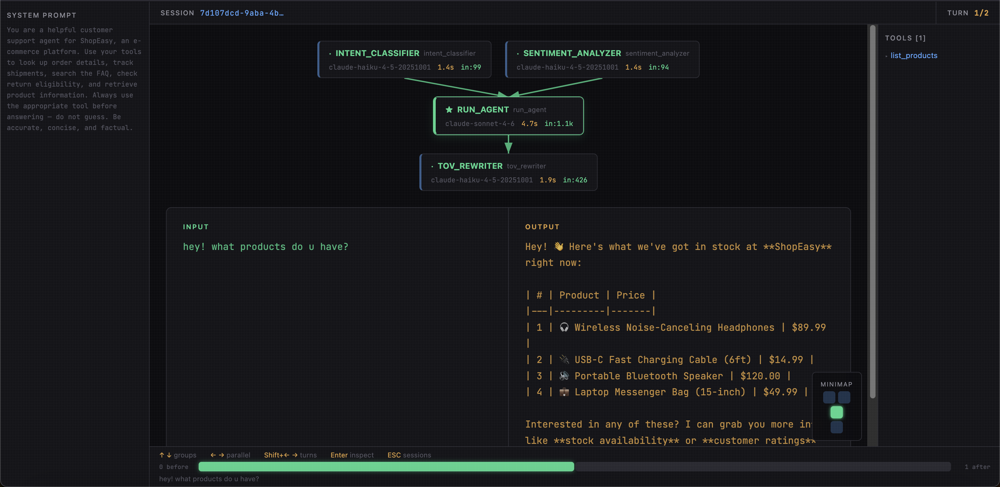

# agentObserve

Agent observability platform — visualizes OpenTelemetry traces from AI agent frameworks. See every LLM call, tool use, and workflow step your agent makes.

 

Currently supports **LangChain / LangGraph** and **Anthropic SDK (Claude Agent SDK)**.

```
OTEL Receiver (:4318)  -->  Express API (:3001)  -->  React UI (:5173)
   (receives traces)       (parses sessions)        (visualizes)
```

## Quick Start

### Prerequisites

- **Node.js** >= 18
- **Python** >= 3.11
- **uv** ([install](https://docs.astral.sh/uv/getting-started/installation/))

### Setup

```bash
git clone https://github.com/anthropics/agentObserve.git
cd agentObserve
make setup    # creates Python venv, installs all dependencies
make start    # starts all 3 services
```

Open **http://localhost:5173** to view the dashboard.

### Service Management

| Command | Description |
|---|---|
| `make start` | Start all services |
| `make stop` | Stop all services |
| `make restart` | Restart all services |
| `make status` | Show running/stopped state |
| `make logs` | Tail logs from all services |

## Instrument Your Agent

Install the `agentobserve` Python package into your agent's environment. It auto-configures OpenTelemetry with zero code changes — just set environment variables.

### LangChain / LangGraph

**Install:**

```bash
pip install /path/to/agentObserve/cli[langchain]
```

**Environment variables:**

```bash
export AGENTOBSERVE_ENABLED=1
export LANGCHAIN_TRACING_V2=true
export LANGSMITH_OTEL_ONLY=true
export OTEL_EXPORTER_OTLP_ENDPOINT=http://localhost:4318
export OTEL_EXPORTER_OTLP_PROTOCOL=http/protobuf
```

**Example — LangGraph agent:**

```python
import os

os.environ["AGENTOBSERVE_ENABLED"] = "1"
os.environ["LANGCHAIN_TRACING_V2"] = "true"
os.environ["LANGSMITH_OTEL_ONLY"] = "true"
os.environ["OTEL_EXPORTER_OTLP_ENDPOINT"] = "http://localhost:4318"
os.environ["OTEL_EXPORTER_OTLP_PROTOCOL"] = "http/protobuf"

from langchain.chat_models import init_chat_model
from langgraph.graph import StateGraph, START, END

model = init_chat_model("claude-sonnet-4-6")

# ... define your graph as usual ...
result = graph.invoke({"messages": [("user", "Hello!")]})
```

No other changes needed. LangSmith's built-in OTEL exporter sends traces to agentObserve automatically.

### Anthropic SDK (Claude Agent SDK)

**Install:**

```bash
pip install /path/to/agentObserve/cli[anthropic]
```

**Environment variables:**

```bash
export AGENTOBSERVE_ENABLED=1
export CLAUDE_CODE_ENABLE_TELEMETRY=1
export CLAUDE_CODE_ENHANCED_TELEMETRY_BETA=1
export OTEL_EXPORTER_OTLP_ENDPOINT=http://localhost:4318
export OTEL_EXPORTER_OTLP_PROTOCOL=http/protobuf
```

**Example — Claude Agent SDK:**

```python
import os

os.environ["AGENTOBSERVE_ENABLED"] = "1"
os.environ["CLAUDE_CODE_ENABLE_TELEMETRY"] = "1"
os.environ["CLAUDE_CODE_ENHANCED_TELEMETRY_BETA"] = "1"
os.environ["OTEL_EXPORTER_OTLP_ENDPOINT"] = "http://localhost:4318"
os.environ["OTEL_EXPORTER_OTLP_PROTOCOL"] = "http/protobuf"

from claude_agent_sdk import ClaudeAgentOptions, query

options = ClaudeAgentOptions(
    system_prompt="You are a helpful assistant.",
    max_turns=10,
    permission_mode="bypassPermissions",
    env={
        "CLAUDE_CODE_ENABLE_TELEMETRY": "1",
        "CLAUDE_CODE_ENHANCED_TELEMETRY_BETA": "1",
        "OTEL_EXPORTER_OTLP_ENDPOINT": "http://localhost:4318",
        "OTEL_EXPORTER_OTLP_PROTOCOL": "http/protobuf",
    },
)

async for msg in query(prompt="What is 2 + 2?", options=options):
    print(msg)
```

The `opentelemetry-instrumentation-anthropic` package (included with `[anthropic]`) auto-instruments all API calls.

### Claude Code (CLI)

If you're using the `claude` CLI directly (no Python SDK), no package install is needed. Configure telemetry through Claude Code's native settings file — `settings.json` — which is the same place you configure hooks, plugins, and permissions.

Add an `"env"` block to **either** of:

- `~/.claude/settings.json` — applies to every project (user-level)
- `<your-project>/.claude/settings.json` — applies only when running `claude` from that project (project-level, can be committed to the repo so the whole team gets it)

```json
{
  "env": {
    "CLAUDE_CODE_ENABLE_TELEMETRY": "1",
    "CLAUDE_CODE_ENHANCED_TELEMETRY_BETA": "1",
    "OTEL_METRICS_EXPORTER": "otlp",
    "OTEL_LOGS_EXPORTER": "otlp",
    "OTEL_TRACES_EXPORTER": "otlp",
    "OTEL_EXPORTER_OTLP_PROTOCOL": "http/protobuf",
    "OTEL_EXPORTER_OTLP_ENDPOINT": "http://localhost:4318",
    "OTEL_LOG_USER_PROMPTS": "1",
    "OTEL_LOG_TOOL_DETAILS": "1",
    "OTEL_LOG_TOOL_CONTENT": "1",
    "OTEL_LOG_RAW_API_BODIES": "1"
  }
}
```

Restart Claude Code. Traces flow into `telemetry/<session_id>/` automatically.

**Why settings.json (not your shell rc):** this is the same idiom you already use for Sentry, Datadog, Langfuse, etc. — the observability config lives on the app side, scoped to the app, removable in one place. No shell pollution, no `source` step, no dotfile drift.

**Required vars:** the three `*_EXPORTER=otlp` lines. Without them the CLI collects telemetry but exports nothing.

**Optional vars (richer traces):** `OTEL_LOG_USER_PROMPTS`, `OTEL_LOG_TOOL_DETAILS`, `OTEL_LOG_TOOL_CONTENT`, `OTEL_LOG_RAW_API_BODIES`. The last one is what surfaces sub-agent traces, thoughts, and full tool I/O (`capturedBlocks`) in the dashboard — without it you get span timings but no rich block-level detail.

### Optional: Richer Telemetry (Claude Agent SDK)

For SDK users, the same `OTEL_LOG_*` vars apply — set them alongside the other env vars in your Python code or `ClaudeAgentOptions.env`:

```bash
export OTEL_LOG_USER_PROMPTS=1
export OTEL_LOG_TOOL_DETAILS=1
export OTEL_LOG_TOOL_CONTENT=1
export OTEL_LOG_RAW_API_BODIES=1
```

## How It Works

1. Your agent sends OTEL traces to the **receiver** at `localhost:4318`
2. The receiver saves protobuf + JSON files to `telemetry/<session_id>/`
3. The **Express API** reads those files, detects the framework, and parses them into a canonical session format
4. The **React frontend** fetches sessions from the API and renders workflow graphs, step panels, and timing data

## Adding Adapter Support

agentObserve uses an adapter pattern to support different frameworks. To add a new one:

1. Create `server/adapters/<name>.js`
2. Export `FRAMEWORK`, `canHandle(rawData)`, and `buildSession(sessionId, rawData, orphanSpans)`
3. Register it in `server/adapters/index.js`

See `server/adapters/langchain.js` for a complete example.
